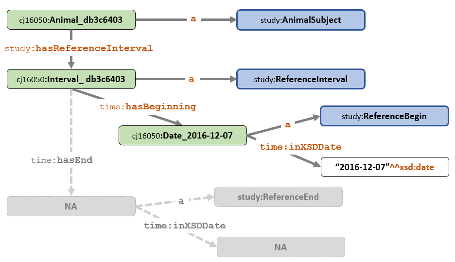

<link href="styles.css?v=2" rel="stylesheet"/>

# SEND Data Conversion and Mapping

## Introduction
The proof of concept is limited to the <b>DM</b> and <b>TS</b> domains. Data was obtained from PHUSE Scripts repository [SEND subfolder](https://github.com/phuse-org/phuse-scripts/tree/master/data/send) and copied over to this project under folders for each example study: /SENDConform/data/studies/Study Name  .

Two alternate methods are provided for the data conversion process. In method one, R scripts read the source SAS XPT file and convert it to TTL for import into any triplestore. 

The same data conversion R scripts simultaneously create .CSV files to support a second method of importing data into a Stardog triplestore using Stardog Mapping Syntax (SMS). A benefit of using SMS is that the project team already has an RShiny app for visualizing the SMS map files. The visualizations assist schema validation and aid construction of SPARQL queries. R2RML is a vendor-neutral alternative to SMS that is out of scope for this project. 

A third SAS-based method may be provided later, time permitting.

## Source Data

SAS transport XPT data files for conversion and testing are located in the folder:
<pre>
  SENDConform/data/studies/Study Name 
</pre>

These files are read in by the conversion scripts with data exported to the /ttl folder:
<pre>
    SENDConform/data/studies/Study Name/ttl
</pre>

The /csv folder contains data in comma-delimited format for ease of viewing the data in  Excel. These files are raw, source data and are not used for mapping into the triplestore.

<pre>
    SENDConform/data/studies/Study Name/csv
</pre>

## General Guidance

### Generating Unique Identifiers for Animal Subjects
It may seem reasonable to use SUBJID and USUBJID when forming IRIs for Animal Subjects. IRI creation is simple and the human-readable IRI facilitates traceability back to the original source values. For example, the IRI for Subject 00M01 would be:
`cj16050:Animal_00M01`

However, the use of SUBJID is fraught with problems. Consider cases where:

* A SUBJID is accidentally re-used and assigned to more than one animal. Two unique individuals would have the same ID number and the resulting RDF would have all observations assigned to a single IRI. There would be difficult to detect this duplication after data is converted to the graph. 

* The same animal is accidentally assigned two different SUBJID values. Values are incorrectly assigned to two separate individuals. 

* A row of data is accidentally duplicated, a condition that could go undetected when converting the data to RDF.

A solution is to create IRIs for critical components like **Animal Subject** and **Reference Intervals** that are independent from values in the source data. For the purpose of this prototype, a truncated SHA-1 hash of a randomly generated value (with a known seed value) is used to create the required IRIs, including IRIs for data collection events, intervals, and other components in the data model.

Following this method:

* IRIs remain constant during multiple runs of the development code. 
* IRIs for subject identifiers, intervals, data collection events and other components in the data model are not dependent on instance data, which could be incorrect. 
* Testing for duplicate, missing, and incorrect instance data becomes possible thanks to data-independent of IRIs. 

Example Animal Subject IRI: `cj16050:Animal_a6d09184`

Methods to generate UIDs for subjects in real-world settings is beyond the mandate of this project.See the [Technical Details page](https://github.com/phuse-org/UIDPharma/blob/master/UUIDTechDetails.md)) of the project [Unique Identifiers for the Pharmaceutical Industry]https://github.com/phuse-org/UIDPharma) for more information on generating unique identifiers. 

### Reference Interval IRIs

Date values for reference start date (rfstdtc) and reference end date (rfendtc) are not directly attached to the Animal Subject IRI. Rather, the `cj16050:Animal_<hashvalue>` has a Reference Interval IRI `cj16050:Interval_<hashvalue>` which in turn has two date IRIs attached via the `time:hasBeginning` and `time:hasEnd` predicates (**Figure 1**).  

  **Figure 1: Animal_99T1 (incomplete data)**

Reference Interval IRIs are still created when either start or end date is missing (**Figure 2**), because the data for the non-missing date  must be captured in the graph. A Reference Interval may also be created when ***both** start and end dates are missing. 

  **Figure 2: Animal_99T5 Missing rfendtc**

### RDF Project Conventions
#### Labels

* `skos:prefLabel` is the primary label used in the graph. `rdfs:label` contains supplemental labels. For controlled terms, `skos:prefLabel` contains the industry standard (CDISC) label, which is often in plural form (DAYS, WEEKS, etc.) while `rdfs:label` contains the W3C standard in singular form (DAY, WEEK, etc.)

# Conversion Details 

## R Programs

| Order  | File                 | Description                                  |
| ------ | -------------------- | ---------------------------------------------|
| 1.     | driver.R             | Main driver program for data conversion. Graph metadata creation. Creation of observations to test constraints.|
| 2.     | DM_convert.R         | DM conversion to TTL file. (under development) |
| 3.     | TS_convert.R         | TM conversion to TTL (not yet written)   |

## Graph Metadata 
Graph metadata, including data conversion date and graph version, is created within the **driver.R** script and exported to a TTL file for upload into the triplestore and a corresponding .csv file for SMS mapping purposes.

| File      | Role                     | Description                                  |
| --------- | ------------------------ | ---------------------------------------------|
|Graphmeta-*StudyName*.csv | Basic graph metadata | Description of graph content, status, version, and time stamp information. |
|Graphmeta-*StudyName*-map.TTL|SMS Map | Map CSV to Stardog graph. |
|Graphmeta-*StudyName*.TTL| RDF Triples | TTL file for loading directly into triplestore. |

### DM 

| File      | Role                     | Description                                  |
| --------- | ------------------------ | ---------------------------------------------|
| DM-CJ16050.CSV | Demographics        | May be a subset during development. 
| DM-CJ16050-R-map.TTL | SMS Map       | Map CSV to Stardog graph. 
| DM-CJ16050-R.TTL | RDF Triples       | TTL file for loading directly into triplestore. 

#### CJ16050
##### Data Imputation

| Variable     | Value(s)            | Description                                  |
| ------------ | ------------------- | ---------------------------------------------|
| SPECIESCD_IM |  "Rat"              | Species Code not specified in DM data file.
| AGEUNIT_IM   |  "Week"             | A representation of the age unit that is used to link to time namespace. 
| DURATION_IM  | "P56D"              | Duration code, derived from 8 weeks x 7 days/wk. 

##### Data
-   **/data/studies/RE Function in Rats/ttl**

File  | Description    | Contact
---------|----------------------------------|-----------------------------------
cj16050.ttl | Instance data file. Outdated as of 2019-08-02 | 
cjprot.ttl | Nonclinical study protocol file for study CJ16050 | AO
cj160500send.shapes.ttl | Combines the instance file with the SEND ontology to support automated SEND dataset creation. It currently recreates the first record of the pilot DM domain. TS not yet included.  | AO 
DM-CJ16050-R.csv | Data file created by R for mapping DM domain data to triplestore using SMS | TW
DM-CJ16050-R.TTL | Data file created by R for direct load into triplestore | TW
DM-CJ16050-R-map.TTL | SMS map for DM-CJ16050-R.csv  to Stardog
Graphmeta-CJ16050.csv | Graph metadata file for mapping to triplestore using SMS | TW
GraphMeta-CJ16050.TTL | Graph metadata file for direct load into triplestore  | TW
Graphmeta-CJ16050-map.TTL | SMS map for Graphmeta-CJ16050.csv to Stardog | TW
SENDConform-CJ106050LoadDriver.bat | Driver .BAT file that calls SENDConform-CJ106050LoadSequence.bat. Needed for Windows. | TW
SENDConform-CJ106050LoadSequence.bat | Loads data into Stardog using a series of SMS calls.
study.ttl | Ontology file from the CTDasRDF project, updated to support nonclinical data | AO
send.ttl |  "bare bones" SEND ontology to allow exporting protocol and instance data into SEND format. | AO
 

**Additional Details**  

The protocol file imports the study ontology. The instance file imports the protocol file. When ready to "publish" in SEND it also imports the SEND ontology into a new file called:  cj160500send.shapes.ttl

 cj160500send.shapes.ttl has everything integrated and linked into one mega-graph, so that SHACL rules pertaining to data quality have a home by linking to resources under the study: namespace and SHACL rules pertaining to SEND conformance issues can be linked to resources under the send: namespace.  For example, time interval is a universal concept with start date must be before end date is a universal, "data quality" type of issue, and sure enough the rules can be linked to the time:Interval class. On the other hand, the fact that a SEND domain like DM or TS must be present, this is a SEND specific conformance rule that can be linked to the send:SENDDomain_DM  or send:SENDDomain_TS class.  - AO
 
send.ttl file is a bare bones ontology written by AO from scratch to support the pilot. It in essence documents the requirements for what a robust SEND ontology should be able to support at a minimum to allow round-tripping and now, SHACL rules validation.  It would be useful if other team members could look at this work and try replacing this rudimentary ontology with something more robust, capable of supporting all the domains not just DM/TS.  - AO
    
### TS

*Future development*

[Back to TOC](TableOfContents.md)
