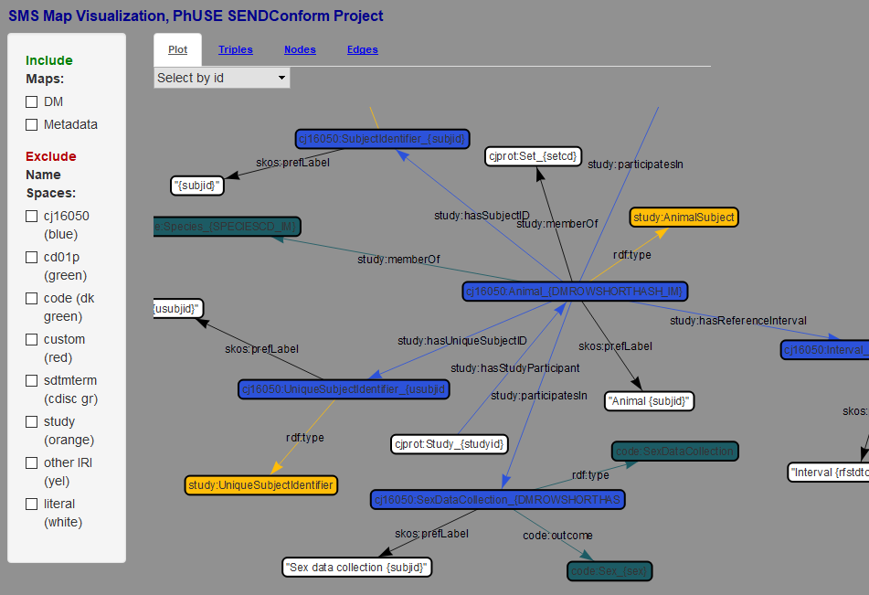

<link href="styles.css?v=2" rel="stylesheet"/>

# Data Mapping with Stardog SMS

## Introduction
Stardog Mapping Syntax (SMS) [(stardog.com)](https://www.stardog.com/docs/#_stardog_mapping_syntax) is provided as an alternative data mapping and upload process. The same data conversion scripts that produce TTL files for upload into a triplestore also create a .CSV file that can be mapped to the database. ***The .CSV files do not contain the full set of data for evaluating the test cases.***

Why create this redundancy when the data does not contain the full set of test cases? The team benefits from having an RShiny app that reads in the SMS file and produces a network visualization of the data schema. This schema is used during the development to help ensure the nodes and relations are being constructed correctly. The visualization also aids in SHACL Shape and SPARQL query development. 

## Conversion and Mapping Details 
The [Data Conversion and Mapping](DataConversion.md) page documents the source data and R Scripts used to create the .CSV files used by the SMS maps, including generation of values like SHA-1 hashes used in both methods. 

Each CSV file has a corresponding map file in TTL format with "-map" appended to the name. 

### Graph Metadata

| File      | Role                     | Description                                  |
| --------- | ------------------------ | ---------------------------------------------|
|Graphmeta-StudyName.csv | Basic graph metadata | Description of graph content, status, version, and time stamp information. |
|Graphmeta-StudyName-map.TTL|SMS Map | Map CSV to Stardog graph. |

### DM
| File      | Role                     | Description                                  |
| --------- | ------------------------ | ---------------------------------------------|
| DM-CJ16050.CSV | Demographics        | May be a subset during development. 
| DM-CJ16050-R-map.TTL | SMS Map       | Map CSV to Stardog graph. 

## SMS Format
The SMS files follow very strict formatting rules that go beyond the Stardog specification, primarily due to weak parsing expressions in the RShiny visualization code (this can easily be improved!). These rules include:
* `subject` is <i>hard left</i> on line by itself.
* p`redicate`, `object` line:
    * indented at least one space.
    * end with a `;` on same line, no trailing spaces
* No short hand for `predicate`s. Use 'rdf:type', not 'a' .
* File must end with carriage return on a line by itself.

The excerpt from the mapping file for the DM domain shows the AnimalSubject triples.  Values within `{ }` are substituted from the named columns in the .CSV file as the file is processed line-by-line.

<pre class="sms">
# Animal Subject
cj16050:Animal_{DMROWSHORTHASH_IM} 
  rdf:type                    study:AnimalSubject ;
  skos:prefLabel              "Animal {subjid}"^^xsd:string ;
  study:hasReferenceInterval  cj16050:Interval_{DMROWSHORTHASH_IM} ;
  study:hasSubjectID          cj16050:SubjectIdentifier_{subjid} ;
  study:hasUniqueSubjectID    cj16050:UniqueSubjectIdentifier_{usubjid} ;
  study:memberOf              cjprot:Set_{setcd} ;
  study:memberOf              code:Species_{SPECIESCD_IM} ;
  study:participatesIn        cj16050:AgeDataCollection_{DMROWSHORTHASH_IM} ;
  study:participatesIn        cj16050:SexDataCollection_{DMROWSHORTHASH_IM} ;
.
</pre>

## Data Upload
Mapping and upload is accomplished by issuing a series of import commands similar to the following, where the database (SENDConform) is specified followed by the mapping file and then the CSV file: 

`stardog-admin virtual import SENDConform DM-CJ16050-R-map.TTL DM-CJ16050-R.CSV`

Typically, a series of these commands are chained together in a batch file to upload all graphs at the same time, including additional files like ontology files.

## Visualization 
An RShiny app for visualization the SMS files is available at [/r/vis/SMSMapVis-appSEND](https://github.com/phuse-org/phuse-scripts/tree/master/r/vis/SMSMapVis-app). Paths within the file `global.R` must change to point to your local clone of the repository.  **Figure 1** shows a screen shot of the SMS files for the DM and Graph Metadata portions of the graph.

**Figure 1: Screen shot from RShiny SMS visualization. **

[Back to TOC](TableOfContents.md)
