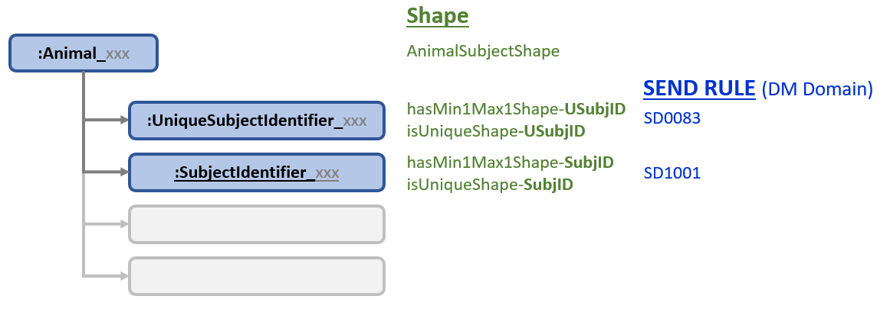

<link href="styles.css?v=1" rel="stylesheet"/>

Animal Subject Shape
==================================

The Animal Subject IRI `:Animal_xxx` is a natural starting point for developing rules based on the DM domain, since each row in DM source data holds values for an Animal Subject. The [Parent Shape](#parentShape) `study:AnimalSubjectShape` contains a property for each type of object attached to the Animal Subject IRI. Shapes that describe similar data, like the identifiers USUBJID and SUBJID, could have been combined into a single shape. They are kept separate to provide more specific reporting aligned with the FDA rules. The approach also provides a standardized pattern for shape creation.

***Figure 1*** provides an overview of the Animal Subject data structure, and corresponding SHACL Shapes and SEND Rules for the DM domain. The constraints in the shapes go well beyond the standard requirements outlined in the FDA rules, as described on this page and the [TestCases](https://github.com/phuse-org/SENDConform/blob/master/SHACL/CJ16050Constraints/TestCases.xlsx) 

<a name='figure1'/>
  
  
  ***Figure 1: Animal Subject Data Structure, SHACL Shapes, FDA Rules***

## Conventions For Shapes

*This section will be moved to another page in the future.*

### Parent Shapes
Parent shapes are named using their target class. Example:  The **AnimalSubject**Shape contains constraints for the class `study:AnimalSubject` . While there is no technical reason to provide this Parent/Child Shape structure during development, the Parent Shape concept helps to guide creation of the Child Shapes and may facilitate later transparency and portability of shapes.

### Child Shapes
Child shapes under the Parent Shape are named using a description of their function and a dash followed by an abbreviated name of the class or entity they act upon. Example:

* `hasMin1Max1Shape-USubjID` - validates that each Animal Subject has a minimum of one and maximum of one USUBJID assigned.  
* `isUniqueShape-USubjID`    -  validates the *uniqueness* of USUBJID values. A SUBJID cannot be assigned to more than one Animal Subject.

Child shapes may include additional constraints such as data type, length, and other restrictions not explicitly stated in the original FDA rules.

All Child Shapes should include the `sh:message` property to provide meaningful messages about the violation when it is tripped. If the constraint is directly related to one of the FDA Rules, the Rule ID number is provided in square brackets at the end of the text. 

Example:  <code>sh:message "Animal Subject --> USUBJID violation <b>[SD0083]</b>" ;</code>

<a name='parentShape'/>

# Animal Subject Parent Shape

  
Rule Statement

   One <code>sh:property</code> for each type of <code>predicate</code> <code>object</code> relation.

  
Description

  Each type of <code>predicate ----> object </code> relation in the parent class, with the exception of predicates like `rdf:type`, `skos:prefLabel`, etc.,  has a `sh:property` definition to a shape for validation of that object.

Test data for Animal Subject 00M01 illustrates the predicates and objects attached to an AnimalSubject IRI.
<pre class='data'>
cj16050:Animal_037c2fdc
    a                          study:AnimalSubject ;
    skos:prefLabel             "Animal 00M01"^^xsd:string ;
    study:hasUniqueSubjectID   cj16050:UniqueSubjectIdentifier_CJ16050_00M01 ;
    study:hasSubjectID         cj16050:SubjectIdentifier_00M01 ;
    study:hasReferenceInterval cj16050:Interval_037c2fdc ;
    study:memberOf             cjprot:Set_00, 
                               code:Species_Rat ;
    study:participatesIn       cj16050:SexDataCollection_037c2fdc ,
                               cj16050:AgeDataCollection_037c2fdc, 
                               cj16050:Randomization_037c2fdc .
</pre>
 

The SHACL Parent Shape `study:AnimalSubjectShape` references numerous child shapes using `sh:property`. Click on the shape names in the SHACL statements below to navigate to a detailed description of each shape. 

<pre class='shacl'>
# Animal Subject Shape
study:AnimalSubjectShape
  a              sh:NodeShape ;
  sh:targetClass study:AnimalSubject ;
  sh:property    study:<a href='#minmax-usubjid'>hasMin1Max1Shape-USubjID</a> ;
  sh:property    study:<a href='#unique-usubjid'>isUniqueShape-USubjID</a> ;
  sh:property    study:<a href='#minmax-subjid'>hasMin1Max1Shape-SubjID</a> ; 
  sh:property    study:<a href='#unique-subjid'>isUniqueShape-SubjID</a> ;
  
  ... more child shapes will be added as they are developed
</pre>
 

##  **USUBJID** FDA Rule

The spreadsheet [FDA-Validator-Rules.xlsx](https://github.com/phuse-org/SENDConform/tree/master/doc/FDA/FDA-Validator-Rules.xlsx) defines the rule for USUBJID in the DM Domain as:

FDA Validator Rule ID | FDA Validator Message | Publisher|  Publisher ID | Business or Conformance Rule Validated | FDA Validator Rule  
------|-------------------|-----|-------|--------------------------|-----------------------------
**SD0083** |Duplicate USUBJID | CDISC| CG0151   |Identifier used to uniquely identify a subject across all studies| The value of Unique Subject Identifier (USUBJID) variable must be unique for each subject **across all trials in the submission.** *

\* *Because the prototype is based on data from a single trial, Rule SD0083 is only evaluated within the context of one study. *

The Rule is deconstructed into the following components based on familiarity with instance data, RDF data model (schema), and SD0083 rule statement:

**1. An Animal Subject cannot have more than one USUBJID**.

**2. An Animal Subject cannot have a missing USUBJID**.

**3. The same USUBJID can not be assigned to more than one Animal Subject**.

Translation of Rule Components into SHACL and evaluation of test data is described below. The first two Rule Components are satisfied by a single SHACL Shape while a second shape is employed for the third component. Test cases in addition to those documented on these pages are available in the file [TestCases.xlsx](https://github.com/phuse-org/SENDConform/blob/master/SHACL/CJ16050Constraints/TestCases.xlsx)

### Rule Components 1,2 : A single,non-missing USUBJID per Animal Subject.

  
Rule Statement

  `:AnimalSubject` has a `sh:minCount` and `sh:maxCount` of 1 USUBJID.

  
Description

  An Animal Subject must be assigned one and only one USUBJID. Missing and multiple USUBJID values are not allowed for an AnimalSubjects.

Animal Subject 00M01 illustrates compliant data with a single USUBJID value.
<pre class='data'>
cj16050:Animal_037c2fdc
  a study:AnimalSubject ;
  skos:prefLabel "Animal 00M01"^^xsd:string ;
  study:hasUniqueSubjectID cj16050:UniqueSubjectIdentifier_CJ16050_00M01  ;
  ... 
</pre>
 

The SHACL shape `study:hasMin1Max1Shape-USubjID` evaluates the path `study:hasUniqueSubjectID` to determine if one and only one value of USSUBJID IRI is present. 

<pre class='shacl'>
# Unique Subject ID (USUBJID)
study:hasMin1Max1Shape-USubjID 
  a              sh:NodeShape ;
  sh:targetClass study:AnimalSubject ;   
  sh:name        "minmaxUniqueSubjid" ;
  sh:description "A single, exclusive USUBJID must be assigned to a Subject." ;
  sh:message     "Animal Subject --> USUBJID violation [SD0083]" ;
  sh:path study:hasUniqueSubjectID ;
  sh:minCount  1 ;
  sh:maxCount  1 .

</pre>
 

#### Example Test Case

Test data for Animal Subject 99T11 shows *two* USUBJID values: 
<pre class='data'>
cj16050:Animal_6204e90c
  a                        study:AnimalSubject ;
  skos:prefLabel           "Animal 99T11"^^xsd:string ;
  study:hasUniqueSubjectID cj16050:UniqueSubjectIdentifier_CJ16050-99T11B,
                           cj16050:UniqueSubjectIdentifier_CJ16050_99T11 ;
  ... 
</pre>

In violation of Rule Component 1 as detected by the constraint:

<pre class='shacl'>
  ... 
  sh:path study:hasUniqueSubjectID ;
  sh:minCount  1 ;
  sh:maxCount  1 
  ... 
</pre>

The report correctly identifies Animal Subject Animal_6204e90c as having more than one USUBJID value, violating the MaxConstraintComponent of FDA Rule SD0083.
<pre class='report'>
  a sh:ValidationResult ;
    sh:resultSeverity            sh:Violation ;
    sh:sourceShape               study:hasMin1Max1Shape-USubjID ;
    sh:focusNode                 cj16050:Animal_6204e90c ;
    sh:resultMessage             "Animal Subject --> USUBJID violation [SD0083]" ;
    sh:resultPath                study:hasUniqueSubjectID ;
    sh:sourceConstraintComponent sh:MaxCountConstraintComponent
</pre>

 
 

 NEXT : discuss the two options for the  Unique value constraint and why one was chosen.

## <NEXT SHAPE>

  
Rule Statement

  
Description

Test data for Animal Subject xxx
<pre class='data'>

</pre>
 

The SHACL shape xxx

<pre class='shacl'>

</pre>

