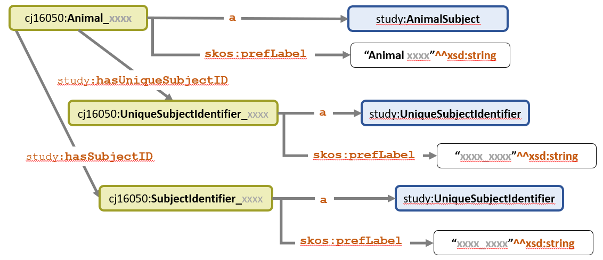

<link href="styles.css?v=1" rel="stylesheet"/>

Animal Subject Shape - Demographics Domain
==================================

The Animal Subject IRI `:Animal_xxx` is a natural starting point for developing rules based on the Demographics domain because each row in the source DM data holds values for an Animal Subject. SHACL shapes are created with reuse in mind, as reflected in both the structure and naming conventions. Where practical, shapes are named using a description of their function, a dash, and then an abbreviated name of the class or entity they act upon. Examples:

* `hasMin1Max1Shape-USubjID` - validates that each Animal Subject has a minimum of one and maximum of one USUBJID assigned.  
* `isUniqueShape-USubjID`    - validates the *uniqueness* of USUBJID values. A SUBJID cannot be assigned to more than one Animal Subject.

Shapes may include additional constraints such as data type, length, and other restrictions not explicitly stated in the original FDA rules.

Shapes must include the `sh:message` property to provide meaningful messages about the violation. Where applicable, a reference to the related FDA Rule ID number must be provided in square brackets at the end of the message text. In cases where a shape may be applied to more than one Rule, all rules are provided.

Example:  <code>sh:message "Animal Subject --> USUBJID violation. <b>[SD0083]</b>" ;</code>

# Animal Subject Shape

  
Rule Statement

   One <code>sh:property</code> for each type of <code>predicate</code>---> <code>object</code> relation attached directly to the AnimalSubject IRI.

  
Description

  Each type of <code>predicate ----> object </code> relation for the AnimalSubject class, with the exception of predicates like `rdf:type`, `skos:prefLabel`, etc.,  has a `sh:property` definition for a shape that validates that type of entity.

Test data for Animal Subject 00M01 illustrates the predicates and objects attached to an AnimalSubject IRI.
<pre class='data'>
cj16050:Animal_037c2fdc
    a                          study:AnimalSubject ;
    skos:prefLabel             "Animal 00M01"^^xsd:string ;
    study:hasUniqueSubjectID   cj16050:UniqueSubjectIdentifier_CJ16050_00M01 ;
    study:hasSubjectID         cj16050:SubjectIdentifier_00M01 ;
    study:hasReferenceInterval cj16050:Interval_037c2fdc ;
    study:memberOf             cjprot:Set_00, 
                               code:Species_Rat ;
    study:participatesIn       cj16050:SexDataCollection_037c2fdc ,
                               cj16050:AgeDataCollection_037c2fdc, 
                               cj16050:Randomization_037c2fdc .
</pre>
 

AnimalSubjectShape references numerous shapes using `sh:property`. Click on the hyperlinks in the SHACL statements below to navigate to details of each rule and its related SHACL shape. 

<pre class='shacl'>
# Animal Subject Shape
study:AnimalSubjectShape
  a              sh:NodeShape ;
  sh:targetClass study:AnimalSubject ;
  sh:property    study:hasMin1Max1Shape-USubjID ; # <a href='#ruleSD0083'>Rule SD0083</a>
  sh:property    study:isUniqueShape-USubjID ;    # <a href='#ruleSD0083'>Rule SD0083</a>
  sh:property    study:hasMin1Max1Shape-SubjID ;  # <a href='#ruleSD1001'>Rule SD1001</a>
  sh:property    study:isUniqueShape-SubjID ;     # <a href='#ruleSD1001'>Rule SD1001</a>
  
  ... more property shapes will be added as they are developed
</pre>
 

##  **USUBJID** : FDA Rule SD0083

***Figure 1*** shows the connection from the Animal Subject IRI to the USUBJID and SUBJID IRI's along with the associated  SHACL Shapes and SEND Rules.

<a name='figure1'/>
  
  
  ***Figure 1: Animal Subject to ID Values, SHACL Shapes, FDA Rules***

The spreadsheet [FDA-Validator-Rules.xlsx](https://github.com/phuse-org/SENDConform/tree/master/doc/FDA/FDA-Validator-Rules.xlsx) defines the rule for USUBJID in the DM Domain as:

FDA Validator Rule ID | FDA Validator Message | Publisher|  Publisher ID | Business or Conformance Rule Validated | FDA Validator Rule  
------|-------------------|-----|-------|--------------------------|-----------------------------
**SD0083** |Duplicate USUBJID | CDISC| CG0151   |Identifier used to uniquely identify a subject across all studies| The value of Unique Subject Identifier (USUBJID) variable must be unique for each subject **across all trials in the submission.** *

\* *Because the prototype is based on data from a single trial, Rule SD0083 is only evaluated within the context of one study. *

The Rule is deconstructed into the following components based on familiarity with instance data, RDF data model (schema), and SD0083 rule statement:

**1. An Animal Subject cannot have more than one USUBJID**.

**2. An Animal Subject cannot have a missing USUBJID**.

**3. A USUBJID cannot be assigned to more than one Animal Subject**.

Translation of Rule Components into SHACL and evaluation of test data is described below. The first two Rule Components are satisfied by a single SHACL Shape while a second shape is employed for the third component. Test cases in addition to those documented on these pages are available in the file [TestCases.xlsx](https://github.com/phuse-org/SENDConform/blob/master/SHACL/CJ16050Constraints/TestCases.xlsx)

### Rule Components 1,2 : A single,non-missing USUBJID per Animal Subject.

  
Rule Statement

  `:AnimalSubject` has a `sh:minCount` and `sh:maxCount` of 1 USUBJID.

  
Description

  An Animal Subject must be assigned one and only one USUBJID. Missing and multiple USUBJID values are not allowed for an AnimalSubjects.

Animal Subject 00M01 illustrates compliant data with a single USUBJID value.
<pre class='data'>
cj16050:Animal_037c2fdc
  a study:AnimalSubject ;
  skos:prefLabel "Animal 00M01"^^xsd:string ;
  study:hasUniqueSubjectID cj16050:UniqueSubjectIdentifier_CJ16050_00M01  ;
  ... 
</pre>
 

The SHACL shape `study:hasMin1Max1Shape-USubjID` evaluates the path `study:hasUniqueSubjectID` to determine if one and only one value of USSUBJID IRI is present. 

FUTURE:  This shape can be updated to `sh:targetClass study:Subject` to be applied to multiple types of Subjects (Animal, Human) when the proper ontology and reasoner is applied.

<pre class='shacl'>
# Unique Subject ID (USUBJID)
study:hasMin1Max1Shape-USubjID 
  a              sh:NodeShape ;
  sh:targetClass study:AnimalSubject ;   
  sh:name        "minmaxUniqueSubjid" ;
  sh:description "A single, exclusive USUBJID must be assigned to a Subject." ;
  sh:message     "Animal Subject --> USUBJID violation. [SD0083]" ;
  sh:path study:hasUniqueSubjectID ;
  sh:minCount  1 ;
  sh:maxCount  1 .

</pre>
 

#### Example Test Case

Test data for Animal Subject 99T11 shows *two* USUBJID values: 
<pre class='data'>
cj16050:Animal_6204e90c
  a                        study:AnimalSubject ;
  skos:prefLabel           "Animal 99T11"^^xsd:string ;
  study:hasUniqueSubjectID cj16050:UniqueSubjectIdentifier_CJ16050-99T11B,
                           cj16050:UniqueSubjectIdentifier_CJ16050_99T11 ;
  ... 
</pre>

In violation of Rule Component 1 as detected by the constraint:

<pre class='shacl'>
  ... 
  sh:path study:hasUniqueSubjectID ;
  sh:minCount  1 ;
  sh:maxCount  1 
  ... 
</pre>

The report correctly identifies Animal Subject Animal_6204e90c as having more than one USUBJID value, violating the MaxConstraintComponent of FDA Rule SD0083.
<pre class='report'>
  a sh:ValidationResult ;
    sh:resultSeverity            sh:Violation ;
    sh:sourceShape               study:hasMin1Max1Shape-USubjID ;
    sh:focusNode                 cj16050:Animal_6204e90c ;
    sh:resultMessage             "Animal Subject --> USUBJID violation. [SD0083]" ;
    sh:resultPath                study:hasUniqueSubjectID ;
    sh:sourceConstraintComponent sh:MaxCountConstraintComponent
</pre>
 
 

<!--- SD003 Rule Component 3 ------------------------------------------------->

### Rule Component 3: A USUBJID cannot be assigned to more than one Animal Subject

Implicit in the definition of USUBJID and Rule SD003 is the fact that the identifier should be assigned to one and only one Animal Subject.

Test data Animal Subjects Animal_252450f2 and Animal_2706cb1e with duplicate USUBJID values
<pre class='data'>
cj16050:Animal_252450f2
    a study:AnimalSubject ;
    skos:prefLabel "Animal 99DUP1"^^xsd:string ;
    study:hasUniqueSubjectID cj16050:UniqueSubjectIdentifier_CJ16050_99DUP1 ;

cj16050:Animal_2706cb1e
    a study:AnimalSubject ;
    skos:prefLabel "Animal 99DUP1"^^xsd:string ;
    study:hasUniqueSubjectID cj16050:UniqueSubjectIdentifier_CJ16050_99DUP1 ;
</pre>
 

There are multiple ways to assess the USUBJID requirement in SHACL-Core and SHACL-SPARQL.  Two SHACL-Core alternatives are discussed here.

#### Method 1: **Identify USUBJIDs** assigned to multiple AnimalSubjects

  
Rule Statement

  The target Object of the `sh:inversePath` for the predicate `study:hasUniqueSubjectID` must have a `sh:maxCount` of 1 .

  
Description

  Targeting the Object of (`sh:targetObjectsOf `) the inverse of (`sh:inversePath`) the predicate `study:hasUniqueSubjectID` identifies USBUJID values that are assigned to more than one AnimalSubject. This test is the most informative when trying to quickly identify <i>duplicate USUBJID values</i>. 

SHACL Shape Method 1: Identify duplicate USUBJID values.
<pre class='shacl'>
study:isUniqueShape-USubjID a sh:PropertyShape ; 
  sh:targetObjectsOf study:hasUniqueSubjectID  ;
  sh:name            "uniqueUSubjid" ;
  sh:description     "A USUBJID must only be assigned to one Subject." ;
  sh:message         "USUBJID assigned to more than one Subject. [SD0083]" ;
  sh:property [
    sh:path [sh:inversePath study:hasUniqueSubjectID]  ;
    sh:maxCount 1
  ] .
</pre>
 

#### Method 2: **Identify the AnimalSubjects** that have the same USUBJID

  
Rule Statement

  The target *Class* `study:AnimalSubject` of the `sh:inversePath` of the predicate `study:hasUniqueSubjectID` must have a `sh:maxCount` of 1 .

  
Description

  The subtle difference in Method 2 is that it identifies the AnimalSubject IRIs that have the same USUBJID, and not directly providing the SUBUJID value.

SHACL Shape Method 2: Identify AnimalSubjects that have the same USUBJID value.
<pre class='shacl'>
study:isUniqueShape-USubjID a sh:PropertyShape ; 
  sh:targetClass   study:AnimalSubject ;   
  sh:property [
    sh:name            "uniqueUSubjid" ;
    sh:description     "A USUBJID must only be assigned to one Subject." ;
    sh:message         "USUBJID assigned to more than one Subject. [SD0083]" ;
    sh:path (study:hasUniqueSubjectID [sh:inversePath study:hasUniqueSubjectID]) ;
    sh:maxCount 1
  ] .
</pre>

***Method 2 was chosen for consistency with the other checks in this section that focus on the identification of AnimalSubjects that fail constraints.***

The report from Method 2 correctly identifies the Animal Subjects Animal_252450f2 and Animal_2706cb1e as sharing the same USUBJID.
<pre class='report'>
a sh:ValidationResult ;
  sh:sourceConstraintComponent sh:MaxCountConstraintComponent ;
  sh:focusNode cj16050:Animal_252450f2 ;
  sh:sourceShape _:bnode_dc2d5e41_a650_456a_87ee_944f84cffae6_826 ;
  sh:resultPath ( study:hasUniqueSubjectID [
    sh:inversePath study:hasUniqueSubjectID
  ] ) ;
  sh:resultMessage "USUBJID assigned to more than one Subject. [SD0083]" ;
  sh:resultSeverity sh:Violation

  ...
  
a sh:ValidationResult ;
  sh:sourceConstraintComponent sh:MaxCountConstraintComponent ;
  sh:focusNode cj16050:Animal_2706cb1e ;
  sh:sourceShape _:bnode_dc2d5e41_a650_456a_87ee_944f84cffae6_826 ;
  sh:resultPath ( study:hasUniqueSubjectID [
    sh:inversePath study:hasUniqueSubjectID
  ] ) ;
  sh:resultMessage "USUBJID assigned to more than one Subject. [SD0083]" ;
  sh:resultSeverity sh:Violation ;
  
  ...
</pre>
 
 

##  **SUBJID** : FDA Rule SD1001

The spreadsheet [FDA-Validator-Rules.xlsx](https://github.com/phuse-org/SENDConform/tree/master/doc/FDA/FDA-Validator-Rules.xlsx) defines the rule for SUBJID in the DM Domain as:

FDA Validator Rule ID | FDA Validator Message | Publisher|  Publisher ID | Business or Conformance Rule Validated | FDA Validator Rule  
------|-------------------|-----|-------|--------------------------|-----------------------------
**SD1001** |Duplicate SUBJID | CDISC| CG0150   |'Subject identifier, which must be unique within the study.| The value of Subject Identifier for the Study (SUBJID) variable must be unique for each subject **within the study**.

The Rule Components and corresponding SHACL shapes for SD1001 are similar to those defined for <a href='#ruleSD0083'>USUBJID/SD0083</a> with exception of the predicate changing to `study:hasSubjectID`and result messages specific to SUBJID instead of USUBJID. Details for SD1001 are therefore not provided here. The SHACL is available in the Shapes file [SHACL-AnimalSubject.TTL](../SHACL/CJ16050Constraints/SHACL-AnimalSubject.TTL)

<b>Next: </b>[Reference Interval (FDA Rule SD1002)](SHACL-AnimalSubject-ReferenceInterval-Details.md)
 
 
Back to [Top of page](#top)  
Back to [Table of Contents](TableOfContents.md)

