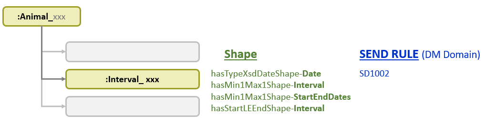

<link href="styles.css?v=1" rel="stylesheet"/>

Animal Subject Shape - Demographics Domain 
==================================

## **Reference Interval** : FDA Rule SD1002

***Figure 1*** shows the connection from the Animal Subject IRI to its Reference Interval and the associated  SHACL Shapes and SEND Rules.

<a name='figure1'/>
  
  
  ***Figure 1: Animal Subject Data Structure, SHACL Shapes, FDA Rules***

The spreadsheet [FDA-Validator-Rules.xlsx](https://github.com/phuse-org/SENDConform/tree/master/doc/FDA/FDA-Validator-Rules.xlsx) defines Rule SD10002 for Reference Start Date (RFSTDTC) and Reference End Date (RFENDTC) as:

FDA Validator Rule ID | FDA Validator Message | Business or Conformance Rule Validated | FDA Validator Rule  
------|-------------------|--------------------------|-----------------------------
**SD1002** |RFSTDTC is after RFENDTC |Study Start and End Dates must be submitted and complete. | **Subject Reference Start Date/Time (RFSTDTC) must be less than or equal to Subject Reference End Date/Time (RFENDTC)**

In the SENDConform Project, RFSTDTC and RFENDTC are modeled as part of a Reference Interval, leading to the deconstruction of the FDA rule into the following Rule Components:

**1. [Reference Start Date and End Date must be in xsd:date format.](#rc1)**

**2. [An Animal Subject has one Reference Interval.](#rc2)**

**3. [A Reference Interval has one Start Date and one End Date.](#rc3)**

**4. [Start Date must be on or before End Date.](#rc4)**

Translation of each Rule Component into SHACL and evaluation of test data is described below. Test cases in addition to those documented on these pages are available in the file [TestCases.xlsx](https://github.com/phuse-org/SENDConform/blob/master/SHACL/CJ16050Constraints/TestCases.xlsx)

# Data Structure

Familiarity with the data structure is necessary to explain the constraints and test cases. **Figure 1** illustrates a partial set of data for test subject 99T1 where the Reference Interval end date *precedes* the start date, thus violating Rule Component 4 of SD1002.

<a name='figure1'/>
  
  
  ***Figure 1: Reference Interval for Animal 99T1 (incomplete data)***
  
# Translation into SHACL

<!--- RULE COMPONENT 1 ------------------------------------------------------->

## Rule Component 1. Reference Start Date and End Date in xsd:date format

  
Rule Statement

  <code>rfstdtc</code> and <code>rfendtc</code> in <code>xsd:date</code> format.  

  
Description

  Reference Start Date (RFSTDTC) and End Date (RFENDTC) must be in 
  date format. The study in this example requires
  `xsd:date`. Other studies may use `xsd:dateTime` or a combination of `xsd:date` 
  and `xsd:dateTime`.

Refer back to [*Figure 1*](#figure1) to compare the data to the SHACL, below.  The shape `:DateFmtShape` uses `sh:targetObjectsOf` to begin evaluation at the object of the predicates `time:hasBeginning` and `time:hasEnd`. These objects must be of type `study:ReferenceBegin` or `study:ReferenceEnd` and have the predicate `time:inXSDDate` that leads to the date value that must be in `xsd:date` format.  

<pre>
Interval IRI - - - time:hasBeginning  - - > Date IRI - - > time:inXSDDate - - > Date value

Interval IRI - - - time:hasEnd  - - > Date IRI - - > time:inXSDDate - - > Date value
</pre>

Test data for Animal Subject 99T4 contains a string value for `rfendtc`. Not shown: Subject 9T10 with string value for `rfstdtc`.
<pre class='data'>

cj16050:Animal_68bab561
  a                          study:AnimalSubject ;
  skos:prefLabel             "Animal 99T4"^^xsd:string ;
  study:hasReferenceInterval cj16050:Interval_68bab561 ;
  ...

cj16050:Interval_68bab561
  a                 study:ReferenceInterval ;
  time:hasBeginning cj16050:Date_2016-12-08 ;
  time:hasEnd       cj16050:Date_7-DEC-16  .
       
cj16050:Date_7-DEC-16
      a study:ReferenceEnd ;
      time:inXSDDate "7-DEC-16"^^xsd:string .
</pre>
 

The shape tests the following conditions:

* A Reference Start Date must be in `xsd:date` format.
* A Reference End Date must be in `xsd:date` format.

Additional dates can be assessed by adding additional predicates as `sh:targetObjectsOf` if the date follows through the path `time:inXSDDate`.

<pre class='shacl'>
study:hasTypeXsdDateShape-Date a sh:NodeShape ;
  sh:targetObjectsOf time:hasBeginning ;
  sh:targetObjectsOf time:hasEnd ;
  sh:or (
    [ sh:class study:ReferenceBegin ]
    [ sh:class study:ReferenceEnd ]
  ) ;  
  ] ;
  sh:property [
    sh:path        time:inXSDDate ;  
    sh:datatype    xsd:date ;
    sh:name        "xsd:date format";
    sh:description "Date format as xsd:date.";
    sh:message     "Date not in xsd:date format. [SD1002]"
  ] .  
</pre>
 

The report correctly identifies the value '7-DEC-16' as a string, violating the xsd:date requirement.
<pre class='report'>
  a sh:ValidationReport ;
    sh:conforms false ;
    sh:result [
      a sh:ValidationResult ;
        sh:resultPath time:inXSDDate ;
        sh:resultSeverity sh:Violation ;
        sh:resultMessage "Date not in xsd:date format. [SD1002]" ;
        sh:value "7-DEC-16" ;
        sh:sourceShape _:bnode_3c9cf811_13d4_43cb_b212_b7097d00b1ed_221 ;
        sh:sourceConstraintComponent sh:DatatypeConstraintComponent ;
        sh:focusNode cj16050:Date_7-DEC-16 ;
    ]
</pre>
 
The Report identifies the dates "7-DEC-16"  and "6-DEC-16" (not shown above). Execute the following SPARQL to find corresponding Animal SUBJECT IRIs and values (`Animal 99T4` for date "7-Dec-16" and `Animal 99T10` for date "6-Dec-16"). Source file: [/SPARQL/Animal-RefInterval.rq](https://github.com/phuse-org/SENDConform/blob/master/SPARQL/Animal-RefInterval.rq)

<pre class='sparql'>
  SELECT ?animalSubjectIRI ?animalLabel ?date 
  WHERE{
    ?animalSubjectIRI a                          study:AnimalSubject ;
                      skos:prefLabel             ?animalLabel ;
                      study:hasReferenceInterval ?intervalIRI .

    ?intervalIRI ?beginOrEnd     ?dateIRI .
    ?dateIRI     time:inXSDDate  ?date .
    FILTER (?dateIRI IN (cj16050:Date_6-DEC-16, cj16050:Date_7-DEC-16))
  }
</pre>

SPARQL independently verifies the test case by finding the two dates that are incorrectly typed as strings. Source file: [/SPARQL/Animal-RefInterval.rq](https://github.com/phuse-org/SENDConform/blob/master/SPARQL/Animal-RefInterval.rq)

<pre class='sparql'>
  SELECT ?refIntervalIRI ?dateIRI ?date ?dateDType
  WHERE{
    ?refIntervalIRI a              study:ReferenceInterval ;
                    ?beginOrEnd    ?dateIRI .
    ?dateIRI        time:inXSDDate ?date .                
    FILTER (datatype(?date) )
}
</pre>

<!--- RULE COMPONENT 2 ------------------------------------------------------->

### Rule Component 2: Subject has one Reference Interval

  
Rule Statement

  <code>:AnimalSubject</code>  <code>:hasReferenceInterval</code>  with <code>sh:minCount</code> and <code>sh:maxCount</code> of 1

  
Description

  Animal Subjects should have one and only one Reference Interval IRI.

This check determines if the Animal Subject has one and only one Reference Interval IRI. While it is possible to have an Interval IRI with no start date and no end date (see [Data Conversion](DataConversion.md)), this rule component only evaluates the case of missing Reference Interval IRIs. Multiple start/end dates for a single subject are evaluated in [Rule Component 3](#rc3). 

Test data for Animal Subject 99T11 has no `study:hasReferenceInterval` .
<pre class='data'>
cj16050:Animal_6204e90c
    a                        study:AnimalSubject ;
    skos:prefLabel           "Animal 99T11"^^xsd:string ;
    study:hasSubjectID       cj16050:SubjectIdentifier_6204e90c ;
    study:hasUniqueSubjectID cj16050:UniqueSubjectIdentifier_6204e90c ;
    study:memberOf           cjprot:Set_00, code:Species_Rat ;
    study:participatesIn     cj16050:AgeDataCollection_6204e90c, cj16050:SexDataCollection_6204e90c .
</pre>
 

The study ontology defines`study:AnimalSubject` as a sub class of both `study:Subject` and `study:Animal`.  Study subjects, be they animal or person, are have a Reference Interval documenting their participation in a trial. Therefore, when the ontology is loaded into the database, the same constraint can be used for both pre-clinical (SEND) and clinical (SDTM) studies. This same ontological approach is taken for [USUBJID](SHACL-AnimalSubject-Details.md#rc12) and [SUBJID](SHACL-AnimalSubject-Details.md#ruleSD1001).

<pre class='owl'>
study:Subject
  rdf:type owl:Class ;
  rdfs:subClassOf study:Party ;
  skos:prefLabel "Subject" ;
.
study:Animal
  rdf:type owl:Class ;
  rdfs:subClassOf study:BiologicEntity ;
  skos:prefLabel "Animal" ;
.
study:AnimalSubject
  rdf:type owl:Class ;
  rdfs:subClassOf study:Animal ;
  rdfs:subClassOf study:Subject ;
  skos:prefLabel "Animal subject" ;
.
</pre>
 

The SHACL shape evaluates the path `study:hasReferenceInterval` from the targetClass to determine if one and only one Reference Interval IRI is present. When the ontology is loaded, the more general `study:Subject` can be leveraged as the targetClass, assuming other `study:Subject`s like `study:HumanStudySubject` use the same predicate. The commented-out alternative is also provided for when the ontology is not loaded, or for cases where the constraint should only apply to `study:AnimalSubject` and not other classes like `study:HumanSubject`.

<pre class='shacl'>
study:hasMin1Max1Shape-Interval a sh:NodeShape ;
  sh:targetClass study:Subject ;  # Ontology
  # sh:targetClass study:AnimalSubject ; # No Ontology 
  sh:path        study:hasReferenceInterval ;
  sh:name        "reference interval present";
  sh:description "Animal Subject must have one and only one reference interval IRI.";
  sh:message     "Animal Subject does not have one Reference Interval IRI. [SD1002]" ;
  sh:minCount    1 ;
  sh:maxCount    1 .
</pre> 
 

The report identifies the IRI `cj16050:Animal_6204e90c` , corresponding to Animal Subject 99T11.
<pre class='report'>
a sh:ValidationReport ;                                                                  
  sh:conforms false ;                                                                  
  sh:result [                                                                          
    a sh:ValidationResult ;                                                          
      sh:sourceShape :SubjectOneRefIntervalShape ;                                 
      sh:resultPath study:hasReferenceInterval ;                                   
      sh:resultSeverity sh:Violation ;                                             
      sh:focusNode cj16050:Animal_6204e90c ;                                       
      sh:resultMessage "Animal Subject does not have one Reference Interval IRI. [SD1002]" ;
      sh:sourceConstraintComponent sh:MinCountConstraintComponent                  
  ]                                                                                    
</pre>
  

<!--- RULE COMPONENT 3 ------------------------------------------------------->

### Rule Component 3. Reference Interval has one Start Date and one End Date

  
Rule Statement

  <code>study:ReferenceInterval</code> <code>time:hasBeginning</code> with <code>sh:minCount</code> and <code>sh:maxCount</code> of 1, <code>sh:and</code> <code>time:hasEnd</code> with <code>sh:minCount</code> and <code>sh:maxCount</code> of 1

  
Description

  Each Reference interval should have one and only one start date and end date.

Reference interval IRIs are connected to their date values through the paths `time:hasBeginning` and `time:hasEnd`. A correctly formed interval has both start and end dates.

Test data provides the following violations:

* 99T5 missing rfendtc
* 99T9 missing rfstdtc
* 99T8 missing both rfendtc, rfstdtc
* 99T2 >1 rfstdtc, >1 rfendtc  

Only the data and report for 99T5 is shown here, where start date is present and end date is missing for the Reference Interval.
<pre class='data'>
cj16050:Animal_db3c6403
  a                          study:AnimalSubject ;
  skos:prefLabel             "Animal 99T5"^^xsd:string ;
  study:hasReferenceInterval cj16050:Interval_db3c6403  ;
  study:hasSubjectID         cj16050:SubjectIdentifier_db3c6403 ;
  study:hasUniqueSubjectID   cj16050:UniqueSubjectIdentifier_db3c6403 ;
  study:memberOf             cjprot:Set_00, code:Species_Rat ;
  study:participatesIn       cj16050:AgeDataCollection_db3c6403, cj16050:SexDataCollection_db3c6403 .

cj16050:Interval_db3c6403
  a                 study:ReferenceInterval ;
  skos:prefLabel    "Interval 2016-12-07 NA"^^xsd:string ;
  time:hasBeginning cj16050:Date_2016-12-07 .
</pre>
 
 
The study ontology defines`study:ReferenceInterval` as a sub class of `study:EntityInterval`. 

<pre class='owl'>
study:EntityInterval
  rdf:type owl:Class ;
   rdfs:subClassOf time:Interval ;
  skos:prefLabel "Entity interval" ;
.
study:ReferenceInterval
  rdf:type owl:Class ;
  rdfs:subClassOf study:EntityInterval ;
  skos:prefLabel "Reference interval" ;
.
study:Lifespan
  rdf:type owl:Class ;
  rdfs:subClassOf study:EntityInterval ;
  skos:prefLabel "Lifespan" ;
.
study:MedicalConditionInterval
  rdf:type owl:Class ;
  rdfs:subClassOf study:EntityInterval ;
  skos:prefLabel "Medical event interval" ;
.
study:StudyParticipationInterval
  rdf:type owl:Class ;
  rdfs:subClassOf study:EntityInterval ;
  skos:prefLabel "Study participation interval" ;
.
</pre>
 

All sub classes of `study:EntityInterval` must have a `time:hasBeginning` and `time:hasEnd`,  allowing the use of a single shape to evaluate following types of intervals when the ontology is loaded into the database:

* `study:ReferenceInterval`
* `study:LifeSpan` 
* `study:MedicalConditionalInterval`
* `study:StudyParticipationInterval`

The ontology facilitates the use of the shape in both pre-clinical (SEND) and clinical (SDTM) studies.  
 
The shape tests the following conditions:

* Interval Start date for an Animal Subject has one and only one value.
* Interval End date for an Animal Subject has one and only one value.

<pre class='shacl'>
study:hasMin1Max1Shape-StartEndDates a sh:NodeShape ;
  sh:targetClass study:EntityInterval ; # Ontology
  # sh:targetClass study:ReferenceInterval ; # No Ontology
  sh:name        "intervalDateCount" ;
  sh:description "Interval has one and only one start and end date." ;
  sh:message     "Problem with Interval date. [SD1002]" ;
  sh:and (
    [ sh:path time:hasBeginning ;
      sh:minCount 1;
      sh:maxCount 1
    ]
    [
      sh:path time:hasEnd ;
      sh:minCount 1;
      sh:maxCount 1
    ]
 )
.
</pre> 
 

The report identifies the interval for Animal Subject 99T5 (`cj16050:Interval_db3c6403`) as violating the constraint.
<pre class='report'>
  a sh:ValidationResult ;
    sh:sourceConstraintComponent sh:AndConstraintComponent ;
    sh:focusNode cj16050:Interval_db3c6403 ;
    sh:resultMessage "Problem with Interval date. [SD1002]" ;
    sh:value cj16050:Interval_db3c6403  ;
    sh:sourceShape :RefIntervalDateShape ;
    sh:resultSeverity sh:Violation ;
</pre>
 

<!--- RULE COMPONENT 4 ------------------------------------------------------->

### Rule Component 4. Start Date on or before End Date

  
Rule Statement

  For interval, <code>! (?endDate >= ?beginDate )</code>

  
Description

  Interval start date must be on or before end date. When the constraint is violated the report must display the <b>FDA Validator Message</b> "RFSTDTC is after RFENDTC"

 
Referring back to [**Figure 1**](#figure1), the reference start and end dates are not directly attached to either an Animal Subject or that Subject's Reference Interval IRI. This indirect connection makes the comparison of the two date values more complex, so SHACL-SPARQL is used in place of SHACL-Core. The SPARQL query is written to find cases where the end date is NOT greater than or equal to the start date.
Test data provides the following violations:

*  99T1  start date is after end date
*  99T2  multiple start/end date values, one start date is before one end date value
*  99T10 String value for rfstdtc results in a violation when comparing to rfendtc

Only the data and report for 99T1 is shown below.

<pre class='data'>
cj16050:Animal_184f16eb
    a study:AnimalSubject ;
    skos:prefLabel "Animal 99T1"^^xsd:string ;
    study:hasReferenceInterval cj16050:Interval_184f16eb ;
    study:hasSubjectID cj16050:SubjectIdentifier_184f16eb ;
    study:hasUniqueSubjectID cj16050:UniqueSubjectIdentifier_184f16eb ;
    study:memberOf cjprot:Set_00, code:Species_Rat ;
    study:participatesIn cj16050:AgeDataCollection_184f16eb, cj16050:SexDataCollection_184f16eb .

cj16050:Interval_184f16eb
    a study:ReferenceInterval ;
    skos:prefLabel "Interval 2016-12-07 2016-12-06"^^xsd:string ;
    time:hasBeginning cj16050:Date_2016-12-07 ;
    time:hasEnd cj16050:Date_2016-12-06 .

cj16050:Date_2016-12-07
    a study:ReferenceBegin ;
    skos:prefLabel "Date 2016-12-07"^^xsd:string ;
    time:inXSDDate "2016-12-07"^^xsd:date ;
    study:dateTimeInXSDString "2016-12-07"^^xsd:string .

cj16050:Date_2016-12-06
    a study:ReferenceEnd ;
    skos:prefLabel "Date 2016-12-06"^^xsd:string ;
    time:inXSDDate "2016-12-06"^^xsd:date ;
    study:dateTimeInXSDString "2016-12-06"^^xsd:string .
</pre>
 

The shape tests the following condition:

* Reference Interval Start Date must be on or before End Date
* The shape will also pick up cases where a date is in `xsd:string` format.

As described for [Rule Component 3](#rc3), this shape is applied at `sh:targetClass study:EntityInterval` for intervals that contain `time:hasBeginning` and `time:hasEnd` predicates. The alternative application to `study:ReferenceInterval` is shown for the alternative case when the ontology is not present.

<pre class='shacl'>
study:hasStartLEEndShape-Interval a sh:NodeShape ;
  sh:targetClass study:EntityInterval ; # Ontology
  # sh:targetClass study:ReferenceInterval ; # No Ontology
 sh:sparql [
  a              sh:SPARQLConstraint ;
  sh:name        "sd1002" ;
  sh:description "Interval start date on or before end date." ;
  sh:message     "Interval Start Date on or before End Date";
  sh:prefixes [
    sh:declare [ sh:prefix "time" ;
      sh:namespace "http://www.w3.org/2006/time#"^^xsd:anyURI ;
    ],
    [ sh:prefix "study" ;
      sh:namespace "https://w3id.org/phuse/study#"^^xsd:anyURI ;
    ]  
  ] ;
 sh:select
  """SELECT $this (?beginDate AS ?intervalStart) (?endDate AS ?intervalEnd)
    WHERE {
      $this     time:hasBeginning  ?beginIRI ;
                time:hasEnd        ?endIRI .
      ?beginIRI time:inXSDDate     ?beginDate .
      ?endIRI   time:inXSDDate     ?endDate .
      FILTER  (! (?endDate >= ?beginDate ))
    }""" ;
] .
</pre> 
 

The report identifies the interval for Animal Subject 99T1 where End Date precedes Start Date.
<pre class='report'>
  a sh:ValidationResult ;
  sh:sourceConstraint _:bnode_cacffc33_62e3_4c8b_bdba_e71e398a23dc_29 ;
  sh:sourceShape :SD1002RuleShape ;
  sh:resultMessage "Interval Start Date on or before End Date. [SD1002]" ;
  sh:value cj16050:Interval_184f16eb        ]
  sh:sourceConstraintComponent sh:SPARQLConstraintComponent ;
  sh:resultSeverity sh:Violation ;
  sh:focusNode cj16050:Interval_184f16eb 
</pre>

 

<b>Next:</b> [Animal Subject Age](SHACL-AnimalSubject-Age-Details.md) 
 
 
Back to: 
* [Top of page](#top)  
* [List of AnimalSubject Shapes](TableOfContents.md#animalSubjectShapes)
* [Table of Contents](TableOfContents.md)
