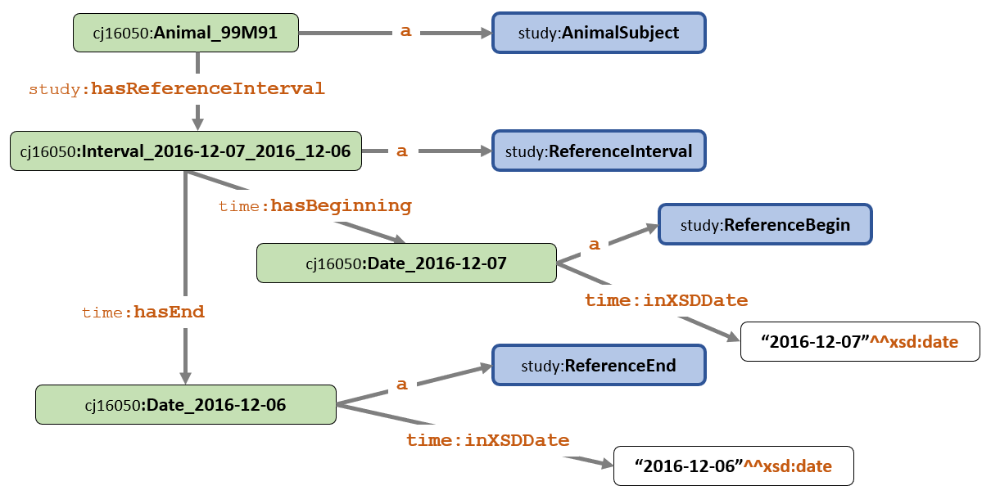

<link href="styles.css" rel="stylesheet"/>

# Modeling SEND Rule SD1002 in SHACL

### 1. FDA Rule

This example models the SEND-IG 3.0 rule **SD1020** for the DM domain as defined in the file [FDA-Validator-Rules.xlsx](https://github.com/phuse-org/SENDConform/tree/master/doc/FDA/FDA-Validator-Rules.xlsx)

FDA Validator Rule ID | FDA Validator Message | Publisher|  Publisher ID | Business or Conformance Rule Validated | FDA Validator Rule  
------|-------------------|-----|-------|--------------------------|-----------------------------
**SD1002** |RFSTDTC is after RFENDTC | FDA| FDAB034    |Study Start and End Dates must be submitted and complete. | Subject Reference Start Date/Time (RFSTDTC) must be less than or equal to Subject Reference End Date/Time (RFENDTC)

Examine the *FDA Validator Rule* and state the complete rule in natural language.

The rule: 

"***Subject Reference Start Date/Time (RFSTDTC) must be less than or equal to Subject Reference End Date/Time (RFENDTC).***"

Contains the following explicit and implicit components:

#### Rule Components

1.1 Reference Start Date (RFSTDTC) and End Date (RFENDTC) must be in date format. The study in this example uses xsd:date while other datasets could also use xsd:dateTime. 

1.2 Animal Subject must have one and only one value for each of RFSTDTC and RFENDTC. (Not explicitly stated in the FDA text.)

1.3 The <b>SD1002 rule</b>: Start Date must be less than or equal to End Date (RFSTDTC less than or equal to RFENDTC). When this rule is violated, the system should supply the standard FDA message "RFSTDTC is after RFENDTC". 

### 2. Data 

This example uses the DM domain data from the study "RE Function in Rats", located in the repository at [/data/studies/RE Function in Rats](https://github.com/phuse-org/SENDConform/tree/master/data/studies/RE%20Function%20in%20Rats) and converted to .TTL using the script [r\\DM-convert.R](https://github.com/phuse-org/SENDConform/blob/master/r/DM-convert.R). 

#### 2.1 Data preparation

The R script adds observations to test the rule components using SHACL constraints. Test observations are identified by  `subjid` and `usubjid` values containing the pattern 99M9<n>. 

A TTL file for development and testing purposes is  created in the location /SHACL/CJ16050Constraints. The TTL file is manually edited to change the format of the date value `7-DEC-16` to `xsd:string` from the original `xsd:date`.

<pre class='data'>
time:inXSDDate "7-DEC-16"^^xsd:string ;
</pre>

Rules violated by test data include: 

**Rule Component 1.1** Start Date and End Date in date (xsd:date) format 

<pre class='data'>
    cj16050:Interval_2016-12-08_7-DEC-16
      a study:ReferenceInterval ;
      time:hasBeginning cj16050:Date_2016-12-08 ;
      time:hasEnd cj16050:Date_7-DEC-16 .
       
    cj16050:Date_7-DEC-16
      a study:ReferenceEnd ;
      time:inXSDDate "7-DEC-16"^^xsd:string .
</pre>    

**Rule Component 1.2** One RFSTDTC/RFENDTC per AnimalSubject 
This section subject to change based on ReferenceInterval IRI creation method

As a result of how the reference intervals are constructed in RDF, duplicate `rfstdtc` and `rfendtc` values will result in additional cj16050:Interval_  values, violating the condition of one interval per AnimalSubject.

*a) More than one interval*

<pre class='data'>
    cj16050:Animal_99M92
      a study:AnimalSubject ;
      study:hasReferenceInterval cj16050:Interval_2016-12-07_2016-12-07, 
                                 cj16050:Interval_2016-12-08_2016-12-08  .
</pre>

*b) no interval*
<pre class='data'>

  *Example Data coming soon*
</pre>

**Rule Component 1.3** : Reference Interval End Date is on or after Start Date 

<pre class='data'>
    cj16050:Animal_99M91
      a                          study:AnimalSubject ;
      study:hasReferenceInterval cj16050:Interval_2016-12-07_2016-12-06 .
    
    cj16050:Interval_2016-12-07_2016-12-06
      a                 study:ReferenceInterval ;
      time:hasBeginning cj16050:Date_2016-12-07 ;
      time:hasEnd       cj16050:Date_2016-12-06 .
    
    cj16050:Date_2016-12-07
      a              study:ReferenceBegin ;
      time:inXSDDate "2016-12-07"^^xsd:date .
    
    cj16050:Date_2016-12-06
      a              study:ReferenceEnd ;
      time:inXSDDate "2016-12-06"^^xsd:date .
</pre>

#### 2.2 Data Structure
Familiarity with the data structure in TTL is necessary to explain the constraints. Here is a partial set of data for subjid 99M91 that violates rule SD1002 because end date preceeds start date.

A graphical representation of the data is shown in Figure 1. 

*Figure 1: Animal_99M91 (incomplete data)*

The full data file used in developing this page is available here: [SHACL\CJ16050Constraints\DM-CJ16050-R.TTL](https://github.com/phuse-org/SENDConform/blob/master/SHACL/CJ16050Constraints/DM-CJ16050-R.TT)

### 3. SHACL Constraints

**3.1 Constraint File**

The SHACL file [SHACL\CJ16050Constraints\SHACL-SD1002.TTL](https://github.com/phuse-org/SENDConform/blob/master/SHACL/CJ16050Constraints\SHACL-SD1002.TTL) begins with the prefixes used in the shapes. 

Shapes defined below the prefixes include: 

Shape        | Rule Component | Check 
-------------|------------|-------------------
`:DateShape`        |1.1 | rfstdtc/rfendtc as xsd:date format 
`:RefIntervalShape` |1.2 | One and only one ReferenceInterval per AnimalSubject
`:SD1002RuleShape`  |1.3 | SD1002 Rule: rfstdtc less than or equal to rfendtc

**3.1.1 :DateShape**
`:DateShape` uses `sh:targetObjectsOf` to select the interval IRI as the (Subject) focus node. The two `sh:targetObjectsOf` follow these paths through the data to obtain the date values: 
<pre>
 Interval IRI - - - time:hasBeginning  - - > Date IRI - - > time:inXSDDate - - > Date value

Interval IRI - - - time:hasEnd  - - > Date IRI - - > time:inXSDDate - - > Date value
</pre>

<pre class='shacl'>
    :DateShape a sh:NodeShape ;
      sh:targetObjectsOf time:hasBeginning ;
      sh:targetObjectsOf time:hasEnd ;
      sh:class study:ReferenceEnd ;
      sh:property [
        sh:path time:inXSDDate ;  
        sh:datatype xsd:date ;
      ] .  
</pre>

Validation Report (excerpt):

<pre class='result'>
    a sh:ValidationReport ;
        sh:conforms false ;
        sh:result [
            a sh:ValidationResult ;
                sh:value "7-DEC-16" ;
                sh:resultPath <http://www.w3.org/2006/time#inXSDDate> ;
                sh:sourceConstraintComponent sh:DatatypeConstraintComponent ;
                sh:focusNode cj16050:Date_7-DEC-16 ;
                sh:sourceShape [] ;
                sh:resultSeverity sh:Violation
</pre>

**3.1.2 RefIntervalShape**

This section subject to change based on ReferenceInterval IRI creation method

<pre class='shacl'>
  :RefIntervalShape a sh:NodeShape ;
    sh:targetClass study:AnimalSubject ;  
    sh:nodeKind sh:IRI ;
    sh:path study:hasReferenceInterval ;
    sh:minCount 1;
    sh:maxCount 1 .
</pre>

Validation Report (excerpt):

<pre class='result'>
   COMING SOON
</pre>

**3.1.3 SD1002RuleShape**
The SD1002RuleShape uses SHACL-SPARQL to determine if the end date (rfendtc) is *NOT* greater than or equal to the start date (rfstdtc), as required by the rule. SHACL Core can not be used for this constraint because the date values are not directly attached to a focus node (refer back to Figure 1). 

<pre class='shacl'>
  :SD1002RuleShape a sh:NodeShape ;
   sh:targetClass study:ReferenceInterval ;
   sh:sparql [
    a sh:SPARQLConstraint ;
    sh:message "End Date must be greater than or equal to Begin Date";
    sh:prefixes [
      sh:declare [ sh:prefix "time" ;
        sh:namespace "http://www.w3.org/2006/time#"^^xsd:anyURI ;
      ],
      [ sh:prefix "study" ;
        sh:namespace "https://w3id.org/phuse/study#"^^xsd:anyURI ;
      ]  
    ] ;
   sh:select
    """SELECT $this (?beginDate AS ?intervalStart) (?endDate AS ?intervalEnd)
      WHERE {
        $this     time:hasBeginning  ?beginIRI ;
                  time:hasEnd        ?endIRI .
        ?beginIRI time:inXSDDate     ?beginDate .
        ?endIRI   time:inXSDDate     ?endDate .
        FILTER  (! (?endDate >= ?beginDate ))
      }""" ;
  ] .
</pre>

Validation Report (excerpt):

<pre class='result'>
   COMING SOON
</pre>

### 4. Applying the Constraints

**4.1 Stardog via Stardog Studio**

**4.1.1 Execute the Report on Data in the Database**

1. Create a test database named SENDConform in Stardog.
1. Load the data file **DM-CJ16050-R.TTL** .
1. Open the SHACL constraint file **SHACL-SD1002.TTL** into Stardog Studio.
1. Select the file type as SHACL (lower right corner of Studio)
1. From the ADD CONSTRAINT drop down (upper left), select the drop down button and choose Get Validation Report. This executes the report without adding the constraint to the database. Too add the constraint to the database so it is available for command line execution (see 4.1.2), select "Add Constraint." **NOTE:** *There are problems removing constraints from the database that may require dropping the data base and recreating it to avoid duplicate messages in the validation report from sucesssive add/remove steps. Observed and reported to Stardog for version 6.1.  2019-07-18.*

1. Scroll through the report and find the resultMessages for the data errors. The report is easier to view from the command line execution. 

**4.1.2 Stardog via command line**

1. Assuming Stardog is available on the command line and the data and constraints are added into the SHACLTest database, execute this command:

    stardog icv report SENDConform

You may redirect the report to a text file on your local machine, assuming you have the repository cloned to C:\_github\SENDConform 

    stardog icv report SHACLTest > "C:\_github\SENDConform\SHACL\CJ16050Constraints\ValReport.txt"

**4.2  TopBraid**

[Back to TOC](TableOfContents.md)
