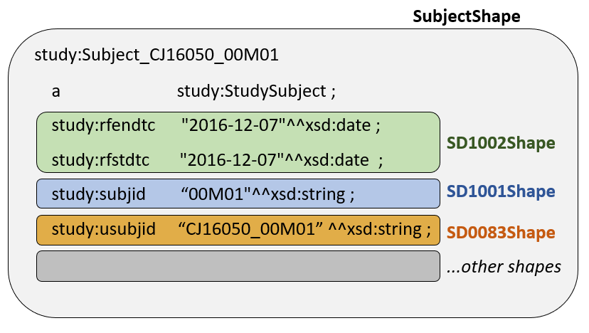

# Modeling a SEND Rule in SHACL
# A Step-by-Step Example

### 1. Data Structure and Implications for Constraints

**1.1 Example Data**

This example uses data from the DM domain for the study "RE Function in Rats", located in the repository at [/data/source/RE Function in Rats](https://github.com/phuse-org/SENDConform/tree/master/data/source/RE%20Function%20in%20Rats) and converted to a .CSV file using R [SHACL\Examples\CreateTTL-CJ16050-DM-SD1002-TestData.R](https://github.com/phuse-org/SENDConform/blob/master/SHACL/Examples/CreateTTL-CJ16050-DM-SD1002-TestData.R). 

The R file adds the following test data to trip validation rules:

**Test-1 : Start date after end date**

    cj16050:Subject_TEST-1
        a study:StudySubject ;
        study:rfendtc "2016-12-08"^^xsd:date ;
        study:rfstdtc "2016-12-09"^^xsd:date .

**Test-2: End date is a string, not a date/dateTime**

    cj16050:Subject_TEST-2
        a study:StudySubject ;
        study:rfendtc "2019-01-30"^^xsd:string ;
        study:rfstdtc "2019-01-29"^^xsd:date .

**Test-2: Duplicate data**

*Details to be added*

The data file for this example is available here: [SHACL\Examples\CJ16050-DM-SD1002-TestData.TTL](https://github.com/phuse-org/SENDConform/blob/master/SHACL/Examples/CJ16050-DM-SD1002-TestData.TTL)

**1.2 Data Structure and Implications for Shape Constraints**

Representation of SEND data as RDF is built around the concept of associating values with a Study Subject. For the DM domain used in this example, there is one row per Study Subject and the triples for Subject CJ16050_00M01 are:

    study:Subject_CJ16050_00M01
        a              study:StudySubject ;
        study:rfendtc  "2016-12-07"^^xsd:date ;
        study:rfstdtc  "2016-12-07"^^xsd:date  ;
        study:subjid   "00M01"^^xsd:string ;
        study:usubjid  "CJ16050_00M01" ^^xsd:string ;
      .... more data...

For validation purposes, an outer "SubjectShape" will be constructed that contains additional shape definitions for the various constraints that apply to the data within the Study Subject. You can visualize this outer shape as a shell (SubjectShape) in the diagram below that encapsulate the other shapes within it (SD1002Shape, SD1001Shape, etc.)

| 
|:--:| 
| *Figure 1. Shapes* |

### 2. FDA Rules
This example models the SEND-IG 3.0 rule **SD1020** for the DM domain as defined in the file [FDA-Validator-Rules.xlsx](https://github.com/phuse-org/SENDConform/tree/master/doc/FDA/FDA-Validator-Rules.xlsx)

FDA Validator Rule ID | FDA Validator Message | Publisher|  Publisher ID | Business or Conformance Rule Validated | FDA Validator Rule  
------|-------------------|-----|-------|--------------------------|-----------------------------
**SD1002** |RFSTDTC is after RFENDTC | FDA| FDAB034    |Study Start and End Dates must be submitted and complete. | Subject Reference Start Date/Time (RFSTDTC) must be less than or equal to Subject Reference End Date/Time (RFENDTC)

Examine the *FDA Validator Rule* and create a complete expression of the rule, capturing all the key components.

The rule: 

"***Subject Reference Start Date/Time (RFSTDTC) must be less than or equal to Subject Reference End Date/Time (RFENDTC).***"

Can be described as: 

1.1 Subject Reference Start Date/Time (RFSTDTC) must be in date format  (xsd:date or xsd:dateTime)

1.2 Subject Reference End Date/Time (RFENDTC) must be in date format  (xsd:date or xsd:dateTime)

1.3 Start Date/Time (RFSTDTC) must be less than or equal to End Date/Time. (RFENDTC)

1.4 There is also the implicit rule that each Study Subject should only have one RFSTDTC and one RFENDTC date. 

* If the End date (RFENDTC) is later than the Start Date (RFSTDTC), the system must supply the error message **"RFSTDTC is after RFENDTC"**. 

### 2. Define the rule in SHACL
You must first define the NodeShape and Class to which the rule will apply, then add the specific rules.

2.1 Define a NodeShape

x.x Rules and data

Create a .TTL file that begins with the prefixes that will be referenced in the rules. In this example, we use the `study:` prefix as a namespace for general information about studies and the `sh:` prefix is used for SHACL. 

Below the prefixes, define the NodeShape Object for the timing constraint. We name the Object using the FDA Validator Rule ID to facilitate reference back to the original source:

    @prefix study: <https://w3id.org/phuse/study#> .
    @prefix sh:   <http://www.w3.org/ns/shacl#> .
    
    study:SD1002 rdf:type sh:NodeShape ;

2.2. Assign the shape to a target class

Within the NodeShape, specify the class to which the constraints will apply. 
In our data, the RFSTDTC and RFENDTC values are associated with the class `study:StudySubject` with data that looks like: 

    cj16050:Subject_CJ16050_00M01
      a             study:StudySubject ;
      study:rfendtc "2016-12-07"^^xsd:date ;
      study:rfstdtc "2016-12-07"^^xsd:date .

Assign the constraints to a class using `sh:targetClass` so your file now looks like:

    @prefix study: <https://w3id.org/phuse/study#> .
    @prefix sh:   <http://www.w3.org/ns/shacl#> .
    
    study:SD1002 rdf:type       sh:NodeShape ;
                 sh:targetClass study:StudySubject ;

2.3 Define Constraints

Revisit Section 1. and define constraints for each component. 

2.3.1 Constraint: RFSTDTC is a Date  (Rule 1.1)

Add a constraint corresponding to Section 1.1 where RFSTDTC must be in date format:

Rule component 1.1 states that RFSTDTC must be in date or dateTime format. The property statement for this rule appears directly below the `sh:targetClass` statement in you file. `sh:name` and `sh:description` identify and describe the rule, which supports FDA rule SD1002 but is not the rule itself (see later). The value of RFSTDTC is always preceded by the predicate `study:rfstdtc`, so that predicate is the object of the `sh:path` predicate in the rule. 

`sh:or` is used to check if the value is in date or dateTime format, and `sh:message` provides the message that will appear in the validation report when the constraint is violated.

The following statements comprise the fomat check for RFSTDTC:

    study:StartEndShape rdf:type sh:NodeShape ;
      sh:targetClass study:StudySubject ;
      sh:property [
        sh:name "RFSTDTC format" ;
        sh:description "RFSTDTC date format validation." ;
        sh:path study:rfstdtc ;
        sh:or (
          [sh:datatype xsd:date ; ]
          [sh:datatype xsd:dateTime ; ]
        ) ;
        sh:message "RFSTDTC is not in date or dateTime format."
      ];

2.3.2 Constraint: RFENDTC is a Date (Rule 1.2)

Add a corresponding rule to check the format of RFENDTC.

    sh:property [
      sh:name "RFENDTC format" ;
      sh:description "RFENDTC date format validation." ;
      sh:path study:rfendtc ;
      sh:or (
        [sh:datatype  xsd:date ; ]
        [sh:datatype  xsd:dateTime ; ]
      ) ;
      sh:message "RFENDTC is not in date or dateTime format." ;
    ] ; 

2.3.3 Constraint: RFSTDTC is Less Than or Equal to RFENDTC (Rule 1.3)

Lastly, add the sequence rule for SD1002 where RFSTDTC must precede or equal RFENDTC. This condition is tested using `sh:lessThanOrEquals` . By convention for this project,  `sh:name` specifies the *FDA Validator Rule ID* the ID also appears in the `sh:description`, pre-pended to the text from the *FDA Validator RUle* field, and in `sh:message` with content from the *FDA Validator Message* field.

This is the end of the validation for SD1002, so the last statment ends with a period instead of a semicolon. 

    sh:property [
      sh:name "SD1002" ;
      sh:description "SD1002: Subject Reference Start Date/Time (RFSTDTC) must be less than or equal to Subject Reference End Date/Time (RFENDTC)" ;
      sh:path             study:rfstdtc ;
      sh:lessThanOrEquals study:rfendtc ;
      sh:message "SD1002: RFSTDTC is after RFENDTC." 
    ].

The complete SHACL file is located in [SHACL\Examples\SHACL_SD1002.TTL](https://github.com/phuse-org/SENDConform/blob/master/SHACL/Examples/SHACL_SD1002.TTL)

### 4. Applying the Constraints

4.1 Stardog via Stardog Studio

4.1.1 Execute the Report on Data in the Database

1. Create a test database named SHACLTest in Stardog.
1. Load the data file CJ16050-DM-SD1002-TestData.TTL .
1. Open the SHACL constraint file SHACL_SD1002.TTL into Stardog Studio.
1. Select the filed type as SHACL (lower right corner of Studio)
1. From the ADD CONSTRAINT drop down (upper left), select the drop down button and choose Get Validation Report.
1. Scroll through the report and find the two shacl#resultMessages for the two data errors. The report is easier to view from the command line exection so see the next section.

4.1.3 b) Stardog via command line

Assuming Stardog is available on the command line and the data and constrains are loaded into the SHACLTest database, execute this command:

    stardog icv report SHACLTest

You may redirect the report to a text file on your local machine, assuming you have the repository cloned to C:\_github\SENDConform :

    stardog icv report SHACLTest > "C:\_github\SENDConform\data\source\RE Function in Rats\csv\ValReport.txt"

4.2  TopBraid
Instructions will be added later for TopBraid.

5. Validation Report

Violation 1:  RFENDTC is of type string, not date or dateTime:

    a sh:ValidationResult ;
      sh:resultPath <https://w3id.org/phuse/study#rfendtc> ;
      sh:resultMessage "RFENDTC is not in date or dateTime format." ;
      sh:sourceShape [] ;
      sh:sourceConstraintComponent sh:OrConstraintComponent ;
      sh:resultSeverity sh:Violation ;
      sh:value "2019-01-30" ;
      sh:focusNode <https://w3id.org/phuse/cd16050#Subject_TEST-2>

Violation 2: RFSTDTC is after RFENDTC

    a sh:ValidationResult ;
      sh:focusNode <https://w3id.org/phuse/cd16050#Subject_CJ16050_TEST-1> ;
      sh:sourceConstraintComponent sh:LessThanOrEqualsConstraintComponent ;
      sh:resultPath <https://w3id.org/phuse/study#rfstdtc> ;
      sh:resultMessage "SD1002: RFSTDTC is after RFENDTC." ;
      sh:value "2016-12-09"^^xsd:date ;
      sh:resultSeverity sh:Violation ;
      sh:sourceShape []

[Back to TOC](TableOfContents.md)
