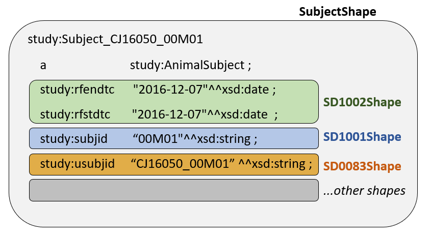

<link href="styles.css" rel="stylesheet"></link>
# Modeling a SEND Rule in SHACL
# A Step-by-Step Example

### 0. Background
The goal of this page is to provide a full, simple, working example of how to model a SEND rule using SHACL. The simplistic data structure does not match the more complex schema used in the main SENDConform project, which is documented elsewhere.

For this example, constraints were structured to maximize information conveyed in the valdiation report using custom `sh:message` for each type of constaint and path. Instead of combining the checks on RFSTDTC for date format and number into a single property path, two separate evaluations are made to faciliate detailed messages in the report. The desire for detailed messages results in longer shapes that can be harder to maintain.  

### 1. Data Structure and Implications for Constraints

**1.1 Example Data**

This example uses data from the DM domain for the study "RE Function in Rats", located in the repository at [/data/source/RE Function in Rats](https://github.com/phuse-org/SENDConform/tree/master/data/source/RE%20Function%20in%20Rats) and converted to a .CSV file using R [SHACL\Examples\CreateTTL-CJ16050-DM-SD1002-TestData.R](https://github.com/phuse-org/SENDConform/blob/master/SHACL/Examples/CreateTTL-CJ16050-DM-SD1002-TestData.R). 

The R file adds the following test data to trip validation rules:

**Test-1: End date is a string, not a date/dateTime**
<pre>
  cj16050:Subject_TEST-1
    a             study:AnimalSubject ;
    study:rfendtc "2019-01-30"^^xsd:string ;
    study:rfstdtc "2019-01-29"^^xsd:date .
</pre>

**Test-2: Duplicate data**
<pre>
  cj16050:Subject_TEST-2
    a             study:AnimalSubject ;
    study:rfendtc "2019-02-02"^^xsd:string ;
    study:rfstdtc "2019-02-13"^^xsd:date .

  cj16050:Subject_TEST-2
    a study:      AnimalSubject ;
    study:rfendtc "2019-02-03"^^xsd:string ;
    study:rfstdtc "2019-02-14"^^xsd:date .
</pre>

**Test-3 : Start date after end date  [FDA Rule SD1002]**
<pre>
  cj16050:Subject_TEST-3
    a             study:AnimalSubject ;
    study:rfendtc "2016-12-08"^^xsd:date ;
    study:rfstdtc "2016-12-09"^^xsd:date .
</pre>

The full data file is available here: [SHACL\Examples\CJ16050-DM-SD1002-TestData.TTL](https://github.com/phuse-org/SENDConform/blob/master/SHACL/Examples/CJ16050-DM-SD1002-TestData.TTL)

**1.2 Data Structure and Implications for Shape Constraints**

RDF triples for this example are created by associating values with an AnimalSubject. One row of data in the source DM file results in triples as shown for Subject CJ16050_00M01:
<pre>
    study:Subject_CJ16050_00M01
        a              study:AnimalSubject ;
        study:rfendtc  "2016-12-07"^^xsd:date ;
        study:rfstdtc  "2016-12-07"^^xsd:date  ;
        study:subjid   "00M01"^^xsd:string ;
        study:usubjid  "CJ16050_00M01" ^^xsd:string ;
      ... more data
</pre>
The FDA Rules are translated to SHACL Shapes that evaluate portions of the data as illustrated in Figure 1. For brevity, this example we will not code the SD1001Shape and SD0083 shapes shown in Figure 1. 

*Figure 1 Shapes*

### 2. FDA Rules
This example models the SEND-IG 3.0 rule **SD1020** for the DM domain as defined in the file [FDA-Validator-Rules.xlsx](https://github.com/phuse-org/SENDConform/tree/master/doc/FDA/FDA-Validator-Rules.xlsx)

FDA Validator Rule ID | FDA Validator Message | Publisher|  Publisher ID | Business or Conformance Rule Validated | FDA Validator Rule  
------|-------------------|-----|-------|--------------------------|-----------------------------
**SD1002** |RFSTDTC is after RFENDTC | FDA| FDAB034    |Study Start and End Dates must be submitted and complete. | Subject Reference Start Date/Time (RFSTDTC) must be less than or equal to Subject Reference End Date/Time (RFENDTC)

Examine the *FDA Validator Rule* and create a complete expression of the rule, capturing all the key components.

The rule: 

"***Subject Reference Start Date/Time (RFSTDTC) must be less than or equal to Subject Reference End Date/Time (RFENDTC).***"

is broken down into the folllowing:

#### Rule Descriptions

2.1 Subject Reference Start Date/Time (RFSTDTC) and End Date/Time must be in date format (xsd:date or xsd:dateTime)

2.2 The implicit rule that each Animal Subject must have a minimum of one and maximum of one value for RFSTDTC and RFENDTC. 

2.3 The <b>SD1002 rule</b> itself: Start Date/Time must be less than or equal to End Date/Time (RFSTDTC less than or equal to RFENDTC). When this rule is violated, the system should supply the standard FDA message "RFSTDTC is after RFENDTC". 

### 3. Define the Constraints

**3.1 SD1002Shape**

Create a .TTL file that begins with the prefixes that will be referenced in the rules. In this example, we use the `study:` prefix as a namespace pertaining to all studies and the `sh:` prefix is used for SHACL. 

Below the prefixes, define the SD1002 rule shape (`study:SD1002Shape`) and the `sh:targetClass` as `study:AnimalShape`
`sh:targetClass` specifies that the constraints in this shape will be applied to all members of the AnimalSubject class.

<pre>
  @prefix study: <https://w3id.org/phuse/study#> .
  @prefix sh:   <http://www.w3.org/ns/shacl#> .
    
  study:SubjectShape a sh:Shape;
      sh:targetClass study:AnimalSubject;
</pre>

**3.2 Constraints**

Define the constraints for the shape by revisiting Section 2. 

**3.2.1 Date Format** (Rule 2.1)
The Date/DateTime constraint for `study:rfstdtc` and `study:rfendtc` are written separately so the validation report message explicitly identifies the value with the validation error. `sh:or` is used to allow either `xsd:date` or `xsd:dateTime` as valid formats, according to the FDA specification.  Note how comments can be inserted into the rules for clarity.

<pre>
  # a. RFSTDTC format
  sh:property [
    sh:path study:rfstdtc ;
    sh:message "Data error: RFENDTC is not in date or dateTime format." ;
    sh:or (
      [sh:datatype xsd:date ; ]
      [sh:datatype xsd:dateTime ; ]
    ) 
  ] ;

  # b. RFENDTC format
  sh:property [
    sh:path study:rfendtc ;
    sh:message "Data error: RFENDTC is not in date or dateTime format." ;
    sh:or (
      [sh:datatype xsd:date ; ]
      [sh:datatype xsd:dateTime ; ]
    ) 
  ] ;
</pre>

**3.2.2 Minimum one / Maximum One value** (Rule 2.2)
One and only one value for both RFSTDTC and RFENDTC must be present in the data. Once again, separate constraints are added to identify the value that validates the constraint. 

<pre>
  # a. RFSTDTC Count
  sh:property [
    sh:path study:rfstdtc; 
    sh:minCount 1 ;
    sh:maxCount 1 ;
    sh:message "Data error: RFSTDTC Min/Max count "
  ] ; 
  
 # b. RFENDTC Count
  sh:property [
    sh:path study:rfendtc; 
    sh:minCount 1 ;
    sh:maxCount 1 ;
    sh:message "Data error: RFENDTC Min/Max count "
  ] ;

</pre>

**3.2.3 SD1002 Rule : RFSTDTC Less than or Equal to RFENDTC** (Rule 2.3)

The SD1002Shape is completed by adding a `sh:lessThanOrEquals` constraint for RFSTDTC and RFENDTC.
<pre>
  sh:property [
    sh:path      study:rfstdtc ;
    sh:lessThanOrEquals  study:rfendtc ;
    sh:message RFSTDTC is after RFENDTC." 
  ]
  .
</pre>

This is the end of the validation for SD1002, so the last statment ends with a period instead of a semicolon. 

The complete SHACL file is located in [SHACL\Examples\SHACL_SD1002.TTL](https://github.com/phuse-org/SENDConform/blob/master/SHACL/Examples/SHACL_SD1002.TTL)

### 4. Applying the Constraints

**4.1 Stardog via Stardog Studio**

**4.1.1 Execute the Report on Data in the Database**

1. Create a test database named SHACLTest in Stardog.
1. Load the data file CJ16050-DM-SD1002-TestData.TTL .
1. Open the SHACL constraint file SHACL_SD1002.TTL into Stardog Studio.
1. Select the filed type as SHACL (lower right corner of Studio)
1. From the ADD CONSTRAINT drop down (upper left), select the drop down button and choose Get Validation Report. This executes the report without adding the constraint to the database. Too add the constraint to the database so it is available for command line execution (see 4.1.2), sellect "Add Constraint."
1. Scroll through the report and find the shacl#resultMessages for the data errors. The report is easier to view from the command line exection. 

**4.1.2 Stardog via command line**

1. Assuming Stardog is available on the command line and the data and constraints are loaded into the SHACLTest database, execute this command:

    stardog icv report SHACLTest

You may redirect the report to a text file on your local machine, aassuming you have the repository cloned to C:\_github\SENDConform 

    stardog icv report SHACLTest > "C:\_github\SENDConform\SHACL\Examples\ValReport.txt"

4.2  TopBraid
Instructions will be added later for TopBraid.

### 5. Validation Report

**Violation 1:  Date Format (Rule 2.1)**
<pre>
  a sh:ValidationResult ;
    sh:resultMessage Data error: RFENDTC is not in date or dateTime format." ;
    sh:resultSeverity sh:Violation ;
    sh:resultPath <https://w3id.org/phuse/study#rfendtc> ;
    sh:focusNode <https://w3id.org/phuse/cd16050#Subject_TEST-1> ;
    sh:sourceShape [] ;
    sh:sourceConstraintComponent sh:OrConstraintComponent ;
    sh:value "2019-01-30"
</pre>

**Violation 2: Minimum one / Maximum One value** (Rule 2.2)
Note how there are two values for each date, so separate messages for RFSTDTC and RFENDTC. SHACL does not identify the values, only the Object (Subject-TEST-2) where the values are duplicated.
<pre>
  a sh:ValidationResult ;
    sh:resultMessage "Data error: RFENDTC Min/Max count " ;
    sh:focusNode <https://w3id.org/phuse/cd16050#Subject_TEST-2> ;
    sh:sourceShape [] ;
    sh:sourceConstraintComponent sh:MaxCountConstraintComponent ;
    sh:resultPath <https://w3id.org/phuse/study#rfendtc> ;
    sh:resultSeverity sh:Violation
    
    
  a sh:ValidationResult ;
    sh:resultPath <https://w3id.org/phuse/study#rfstdtc> ;
    sh:focusNode <https://w3id.org/phuse/cd16050#Subject_TEST-2> ;
    sh:sourceConstraintComponent sh:MaxCountConstraintComponent ;
    sh:resultMessage "Data error: RFSTDTC Min/Max count " ;
    sh:sourceShape [] ;
    sh:resultSeverity sh:Violation
</pre>

**Violation 3: SD1002 Rule : RFSTDTC Less than or Equal to RFENDTC** (Rule 2.3)
<pre>
  a sh:ValidationResult ;
    sh:resultSeverity sh:Violation ;
    sh:value "2016-12-09"^^xsd:date ;
    sh:resultMessage "SD1002: RFSTDTC is after RFENDTC." ;
    sh:sourceConstraintComponent sh:LessThanOrEqualsConstraintComponent ;
    sh:focusNode <https://w3id.org/phuse/cd16050#Subject_TEST-3> ;
    sh:resultPath <https://w3id.org/phuse/study#rfstdtc> ;
    sh:sourceShape []
</pre>

[Back to TOC](TableOfContents.md)
